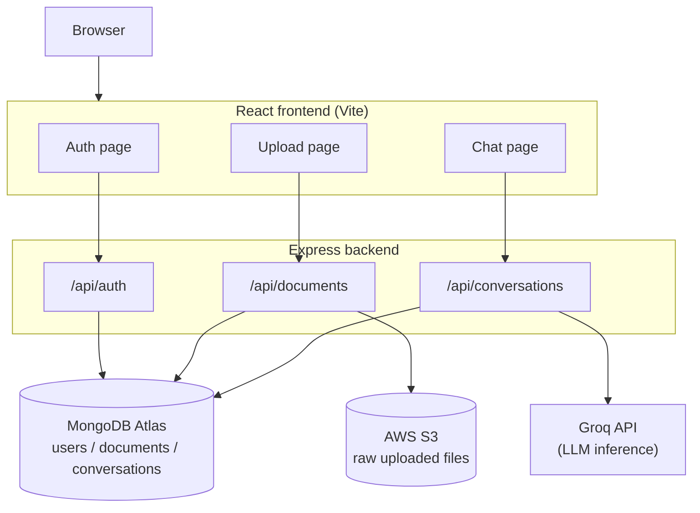

# AI Knowledge Assistant

A full-stack application that lets you upload documents and ask questions about them, grounded entirely in what you've actually uploaded. Built as a portfolio project to demonstrate authentication, file storage, database design, and integrating an LLM into a real product, not just a chatbot demo.

**Live demo:** http://3.80.183.77:5173 

## Why cache-augmented generation instead of RAG

Most "chat with your documents" projects use RAG: chunk the text, embed it, store it in a vector database, and retrieve the top-k most relevant chunks per question. This project deliberately does something different.

**Cache-augmented generation (CAG)** skips retrieval entirely. When you ask a question, the full text of the relevant document(s) is sent directly into the model's context window alongside your question, no embeddings, no vector database, no chunking.

This works well because Groq's models offer very large context windows (over 100K tokens), which comfortably fit a handful of real-world documents. The tradeoff is scale: this approach works well for a personal knowledge base of a reasonable size, but wouldn't hold up against thousands of documents, where retrieval becomes necessary again. That tradeoff was a deliberate design decision for this project's scope, not an oversight.

## Architecture



Both frontend and backend run in separate Docker containers, deployed on a single AWS EC2 free-tier instance.

## Features

- **Auth**: JWT-based signup/login, passwords hashed with bcrypt
- **Document upload**: PDFs and text files, stored in S3, text extracted server-side (`pdf-parse` for PDFs)
- **Persisted conversations**: each chat is saved to MongoDB, listed in a sidebar (similar to Claude/ChatGPT's history), and can be reopened later
- **Document-scoped chat**: a conversation is locked to either one specific document or "all documents" at creation time. Asking something outside a locked document's content gets a clear "I don't have information about that in this document" instead of a guess
- **Fresh session on return**: opening the chat page always starts a new, blank conversation, never auto-resumes the last one, while past conversations stay reachable in the sidebar

## Stack

- **Frontend**: React + TypeScript, Vite, React Router
- **Backend**: Node.js + Express + TypeScript
- **Database**: MongoDB Atlas (`users`, `documents`, `conversations` collections)
- **File storage**: AWS S3
- **AI**: Groq API (`openai/gpt-oss-120b`), temperature 0 for more consistent numeric reproduction
- **Containerization**: Docker + Docker Compose (separate dev and production compose files)
- **Deployment**: AWS EC2 (free tier), deployed manually via SSH/scp

## Known limitations

Being upfront about these rather than hiding them:

- **Table extraction accuracy**: `pdf-parse` converts PDFs to plain text without preserving column alignment. On documents with dense numeric tables, this can occasionally cause the model to misread which digits belong to which column (e.g. reading "9" and "8" from adjacent cells as "98"). Verified during testing with a table-heavy sample document. A production fix would use layout-aware PDF extraction (e.g. a library that detects table structure) rather than plain text extraction.
- **CAG doesn't scale indefinitely**: this approach is well-suited to a personal-scale document set. A knowledge base with hundreds or thousands of documents would need to move to retrieval (RAG) instead, since the full-context approach would exceed even a large context window.
- **No CI/CD pipeline**: deployment is currently manual (SSH in, pull changes, rebuild). A GitHub Actions workflow to automate this was part of the original plan but wasn't implemented in this version.
- **HTTP, not HTTPS**: the live demo runs on plain HTTP with an IP address rather than a domain with an SSL certificate, browsers will flag it as "not secure." This doesn't affect functionality but would be a requirement before any real production use.

## API overview

| Method | Route | Description |
|---|---|---|
| POST | `/api/auth/signup` | Create an account |
| POST | `/api/auth/login` | Log in, returns a JWT |
| POST | `/api/documents/upload` | Upload a PDF or text file (auth required) |
| GET | `/api/documents` | List the logged-in user's documents |
| POST | `/api/conversations` | Start a new conversation, optionally locked to one document |
| GET | `/api/conversations` | List the logged-in user's saved conversations |
| GET | `/api/conversations/:id` | Get one conversation's full message history |
| POST | `/api/conversations/:id/messages` | Ask a question within a conversation |

## Running it locally

1. Copy `backend/.env.example` to `backend/.env` and fill in real values: a MongoDB Atlas connection string, a Groq API key, AWS credentials with S3 access, an S3 bucket name, and a random string for `JWT_SECRET`.
2. From the project root:
   ```
   docker compose up --build
   ```
3. Backend: http://localhost:4000
4. Frontend: http://localhost:5173

## Deploying

`docker-compose.prod.yml` is a separate compose file for production use (no live-reload volumes, runs the compiled build). On the server:

```
docker compose -f docker-compose.prod.yml up --build -d
```

Requires the same `.env` file present on the server, and the server's outbound IP added to MongoDB Atlas's Network Access list.

## What I'd do differently with more time

- Layout-aware PDF table extraction to fix the numeric accuracy issue above
- A GitHub Actions pipeline for automatic deployment on push
- HTTPS via a real domain and a reverse proxy (Caddy or nginx)
- Rate limiting on the chat endpoint, since each question is a real Groq API call
